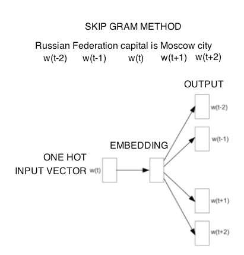

# Solubility Range Multi-class Classification with NLP based Featurization

Aqueous Solubility Range Multi-class classification models in TensorFlow 2.0, using standard Mol2Vec featurizer and a property-aware NLP (skip-gram) adapted/customised featurizer for SMILES molecules. 

### Dependencies

[Numpy](https://anaconda.org/conda-forge/numpy)

[Pandas](https://anaconda.org/anaconda/pandas)

[TensorFlow 2.0](https://www.tensorflow.org/install)

[RDKit](https://www.rdkit.org/docs/Install.html)

[Mol2vec](https://github.com/samoturk/mol2vec)

[Gensim](https://anaconda.org/anaconda/gensim)

[Scikit-learn](https://anaconda.org/anaconda/scikit-learn)

[300-dim mol2vec model](https://github.com/samoturk/mol2vec/blob/master/examples/models/model_300dim.pkl)

### Featurization

SMILES representation of input molecules are featurized using an unsupervised pre-trained NLP-based model, as introduced by Samo Turk et al in [Mol2vec: Unsupervised Machine Learning Approach with Chemical Intuition](https://pubs.acs.org/doi/10.1021/acs.jcim.7b00616). Analagous to Word2vec models that vectorize words such that semantically proximate words are clustered together in the vector space, this approach learns vector representations of molecular substructures that are proximate for chemically related substructures, which is suitable for featurizing molecules for supervised machine learning methods. 

The goal of the work is to compare the performance of the following two molecular featurization methods for solubility range classification

1. Standard Mol2vec (radius = 1)
2. Property-aware NLP (skip-gram) adapted/customised featurizer, described as follows:

The skip-gram method of Natural Language Processing aims to learn word embeddings such that semantically proximate words are clustered closer together in the vector space. It does so by establishing a classification MLP network that maps an input one-hot encoded word vector to a probability distribution for a context word, with the hidden layer representations (lookup table for weights matrix) corresponding to input word vectors being the embedded vector for that word. The qualitative rationale for this method is that, by training such a network, the network's hidden layer representations for semantically similar context sharing words are forced to cluster closer in the vector space since the model maps input words to context words, pair by pair within a window. 

This molecular feauturization method is based on a modified form of the same idea, where molecules are arranged in an order of ascending solubility values, and a MLP regressor is established to map an input molecule (Mol2Vec 300 dim feature vector) to the mean vector representation of molecules in the corresponding context window (two preceeding and two proceeding molecules in the sequence with lesser and greater solubility values), with the hidden layer representations being the final feature vector for the input molecule. This method essentially converts Mol2Vec's standard molecular feature vector to a property-aware vector, which can be used for predicting that property in regression or classification tasks.

